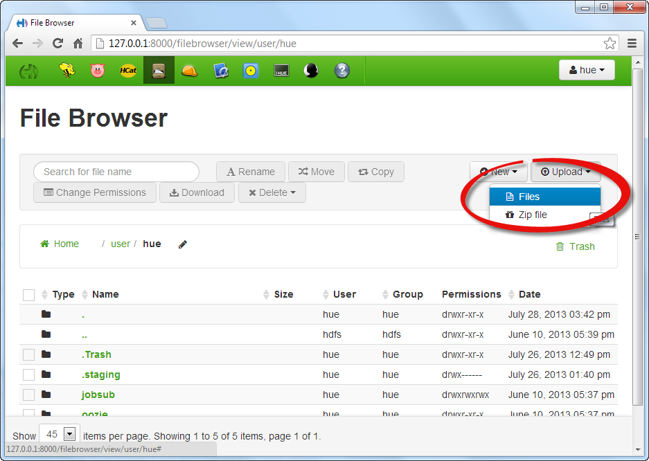

## Community Tutorial 03: Word Counting with Pig

**This tutorial is from the Community part of tutorial for [Hortonworks Sandbox](http://hortonworks.com/products/sandbox) - a single-node Hadoop cluster running in a virtual machine. Download to run this and other tutorials in the series.** 

### Summary

This tutorial describes how to use Pig with the Hortonwork Sandbox to do a word count of an imported text file.

### Create a text file with data

This can be anything but I ended up using the output of some textual data I had in SQL and dumping it into a text file. It’s definitely a little more interesting if you can work with some data you know or at least have an interest in.

### Import the file into the Sandbox

Go to the File Browser tab and upload the .txt file. Take note of the default location it is loading to (/user/hue).



### Write a Pig script to parse the data and dump to a file

I put this code together from snippets I found on the web. The key thing here is to make sure your load statement is referencing the location where your file lives and that you specify an output location to store the file. Note: I didn’t create the /pig_wordcount folder before I ran this, the script ended up creating the location which was a handy feature. Just hit execute and sit back, you can check the run status on the query history tab.

```
a = load '/user/hue/word_count_text.txt';
b = foreach a generate flatten(TOKENIZE((chararray)$0)) as word;
c = group b by word;
d = foreach c generate COUNT(b), group;
store d into '/user/hue/pig_wordcount';
```

### Use HCatalog to load the file to a “table”

Being a SQL developer by day I wanted to be able to query the results in a familiar way so I decided to create a table using HCatalog so that it would be easily accessible through Hive. So I went into the HCatalog tab and chose the file from the folder I specified, named the table and columns, and hit create table. It churned for a while but eventually completed.

### Use Hive to query and sort the data for final output

Finally, I went into the Hive tab and wrote a quick query to return and organize the results. Once it was completed I downloaded it and put the results in Excel so I could print and frame them.


