## Community Tutorial 04: Import from Microsoft SQL Server into the Hortonworks Sandbox using Sqoop

**This tutorial is from the Community part of tutorial for [Hortonworks Sandbox](http://hortonworks.com/products/sandbox) - a single-node Hadoop cluster running in a virtual machine. Download to run this and other tutorials in the series.** 

### Summary

For a simple proof of concept I wanted to get data from MS SQL Server into the Hortonworks Sandbox in an automated fashion using Sqoop. Apache Sqoop provides a way of efficiently transferring bulk data between Apache Hadoop and relational databases. This tutorial will show you how to use Sqoop to import data into the Hortonworks Sandbox from a Microsoft SQL Server data source.

### Preparing the SQL Server Environment 

On the SQL Server side, there are a few key settings that need to be configured to ensure easy connectivity. For the purposes of this tutorial, I’m assuming you’ll be trying to connect to a local install of SQL Server.

#### Create a login using SQL Server Authentication

Let's start by creating a user in SQL Server.  When you create this user make sure to put on your DBA hat and grant all the permissions necessary to connect and access the data (Server Roles, User Mapping)
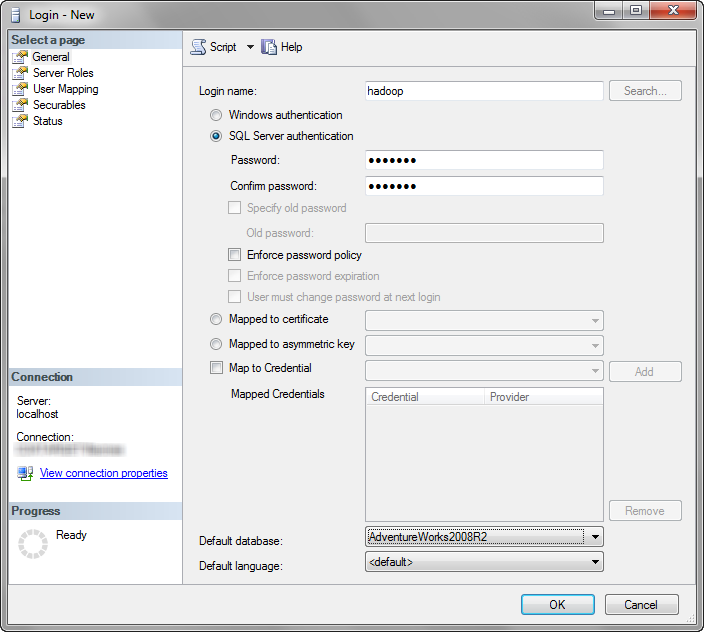


#### Enable Mixed Mode Authentication

Make sure Mixed Mode Authentication is enabled at the server level so that the new user can connect.
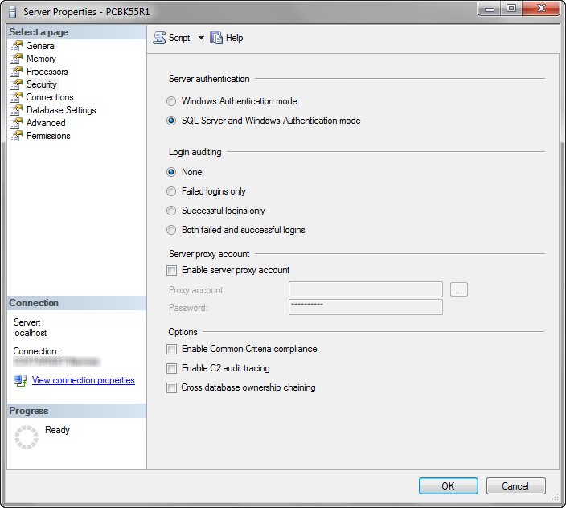

#### Enable TCP/IP Network Protocol

If you’re trying this against a local install of SQL Server, chances are good that the default configuration is set to use the Shared Memory Network Protocol. You can check this setting by running the script below in SQL.
```sql
SELECT 
   CONNECTIONPROPERTY('net_transport') AS net_transport,
   CONNECTIONPROPERTY('protocol_type') AS protocol_type,
   CONNECTIONPROPERTY('auth_scheme') AS auth_scheme,
   CONNECTIONPROPERTY('local_net_address') AS local_net_address,
   CONNECTIONPROPERTY('local_tcp_port') AS local_tcp_port,
   CONNECTIONPROPERTY('client_net_address') AS client_net_address
```

If the code returns Shared Memory as the net_transport (as shown below), you’ll need to go into the SQL Server Configuration Manager, disable Shared Memory, make sure TCP/IP is enabled, and reboot the server.

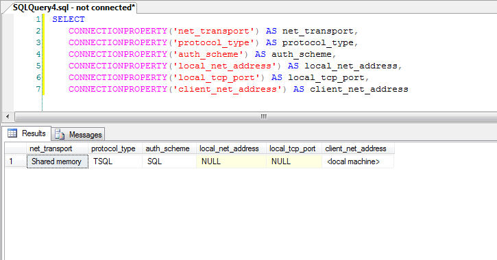

Once you have Shared Memory disabled, running the same code (given above) should return an IP address. Make note of the IP address and the Local TCP Port number as we’ll be using them later in the Sqoop connection string.

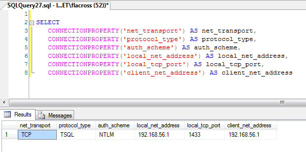

NOTE: It’s probably a good idea at this point to make sure the user is able to connect to the server and access some data. Log in through Management Studio with the credentials and do a SELECT against a table you want to import. If you can’t get to the data this way, Sqoop isn’t going to be able either.

### Preparing the Hortonworks Sandbox

By default, the Microsoft SQL Server JDBC driver is not included in the Sqoop library that ships with the Hortonworks Sandbox so we need to get that driver before we’ll be able to connect the systems.

#### Login To the Virtual Machine

With the Sandbox running, jump into the shell by hitting Alt+F5
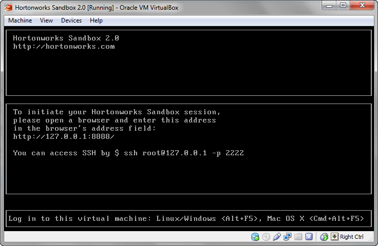

The login and password are root/hadoop and will get you to the following screen
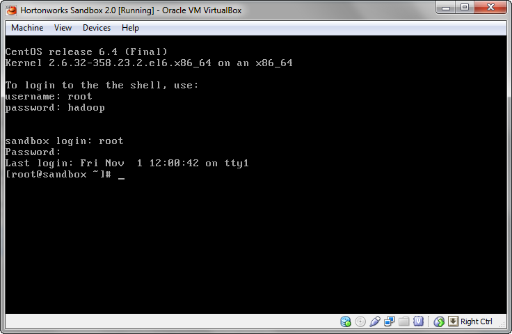

#### Download the SQL Server JDBC Driver

Enter the following command to get to the /usr/local directory
```
cd /usr/local
```
Download and unzip the driver
```
curl -L 'http://download.microsoft.com/download/0/2/A/02AAE597-3865-456C-AE7F-613F99F850A8/sqljdbc_4.0.2206.100_enu.tar.gz' | tar xz
```
You should now see a folder in the directory called sqljdbc_4.0 when you run the ls command.
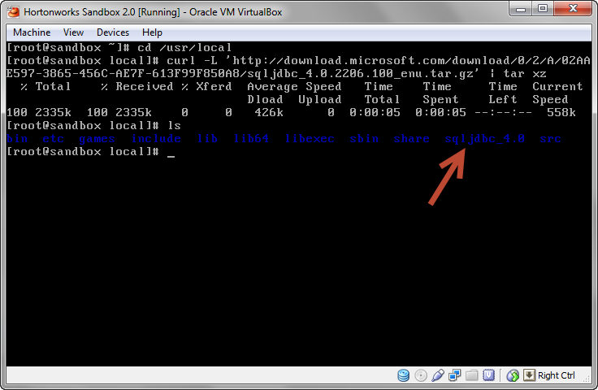

#### Copy the driver to the Sqoop library

While still in the/usr/local/ directory, run the following command to copy the driver out to the Sqoop library folder
```
cp sqljdbc_4.0/enu/sqljdbc4.jar /usr/lib/sqoop/lib
```
Once this runs, you should be able to see the driver in the list of available Sqoop drivers
```
cd /usr/lib/sqoop/lib
```
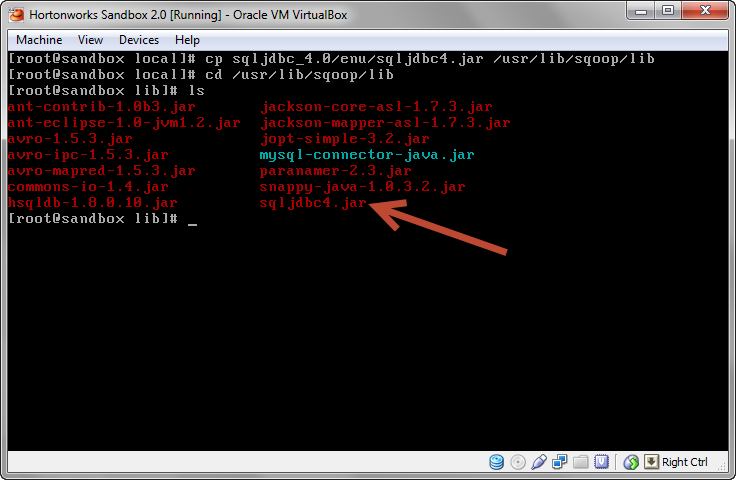

Now that the driver has been added, I recommend restarting the Sandbox completely. I’m sure there are ways to restart certain services so that the new driver becomes available but I had a much easier time just rebooting before continuing on.

### Transfer data using Sqoop

Now we’re finally ready to use Sqoop to connect to SQL and pull data out of Microsoft’s sample [AdventureWorks](http://msftdbprodsamples.codeplex.com/releases/view/59211) database.

#### Build the connection string

Before we start pulling data let’s verify our connection through Sqoop to SQL by listing the available databases. For the purposes of demonstration I’ll be hard coding the password into the connection string. The command for listing databases uses the following syntax
```
sqoop list-databases --connect jdbc:sqlserver://<IP Address>:<Port Number> --username <Username> --password <Password>
```
So for my connection I run the following code, using the IP Address and Port Number I saw earlier along with the user name and password I set up
```
sqoop list-databases --connect jdbc:sqlserver://192.168.56.1:1433 --username hadoop --password hadoop1
```
With that command, Sqoop should return a listing of all the available databases to connect to.

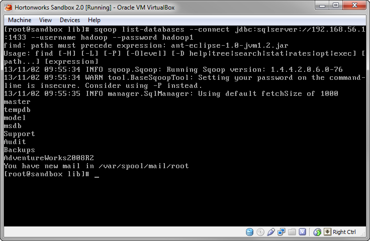

#### Import a Table into Hive

With the AdventureWorks database I will import the Sales.SalesOrderDetail table. The command to import the table is structured like this:
```
sqoop import --connect "jdbc:sqlserver://<IP Address>;database=<Database Name>;username=<Username>;password=<Password>" --table <Table Name> --hive-import -- --schema <Schema Name>
```
So for my import I end up with the following connection string
```
sqoop import --connect "jdbc:sqlserver://192.168.56.1:1433;database=AdentureWorks2008R2;username=hadoop;password=hadoop1" --table SalesOrderDetail --hive-import -- --schema Sales
```
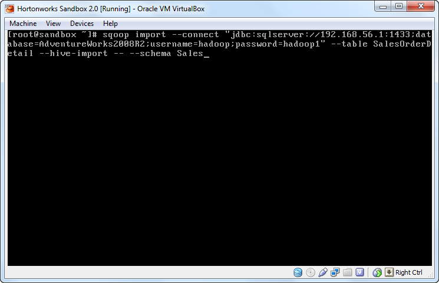

Note: The schema argument is specific to the driver and must be passed at the end of the command after an empty -- (dash dash) argument. If you are importing from the default schema of the database (like dbo) you do not need to specify the schema with this additional argument.

After you execute the command, Hadoop is going to go to work and kick off a MapReduce job. You’ll see a lot of information flying past your eyes, but eventually, you be left with the following results indicating your table has been successfully imported. (Use Shift+PageUp/PageDown if you want navigate through the command prompt information that flew past which is especially useful in debugging).

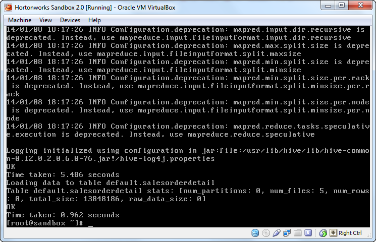

#### Querying the Results

At this point we’re ready to query the Hive table through Beeswax. Go back into the Hue interface and click on the Hive tab and enter a simple select query against the table you imported. After the query runs you will see the results return.
```sql
SELECT * FROM SalesOrderDetail
```
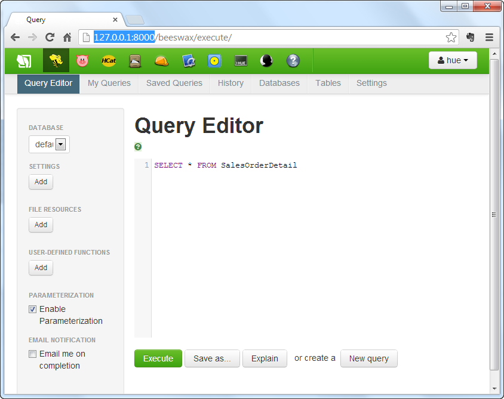

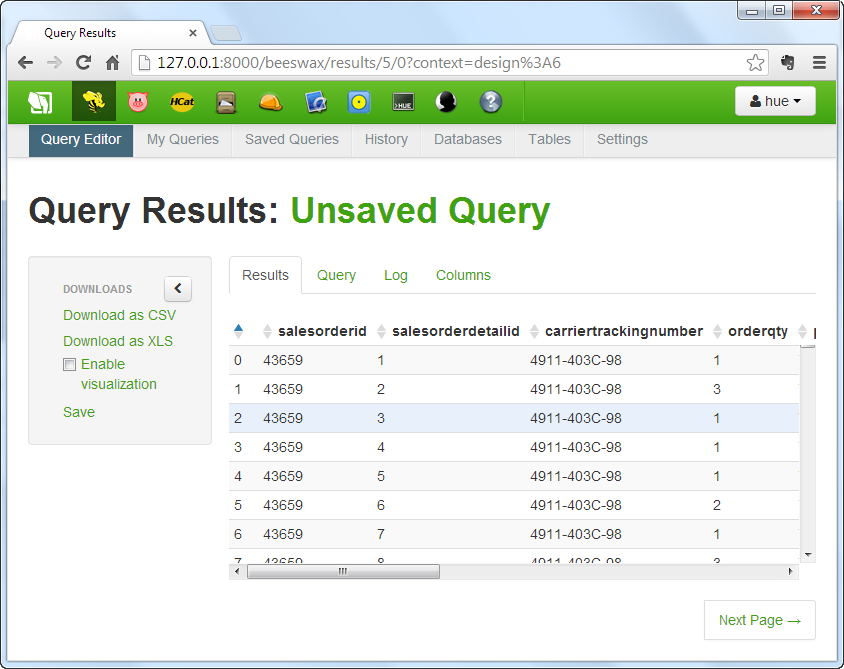

### Conclusion

Sqoop is a powerful tool and can be used with RDBMS systems to provide a number of benefits including incremental imports and exports as well as connectivity to HBase. You can find out more by checking out the [Apache Sqoop](http://sqoop.apache.org/) project page.
