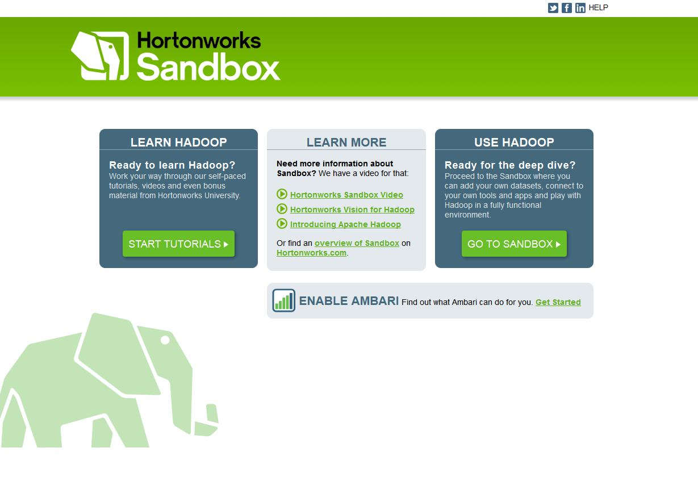
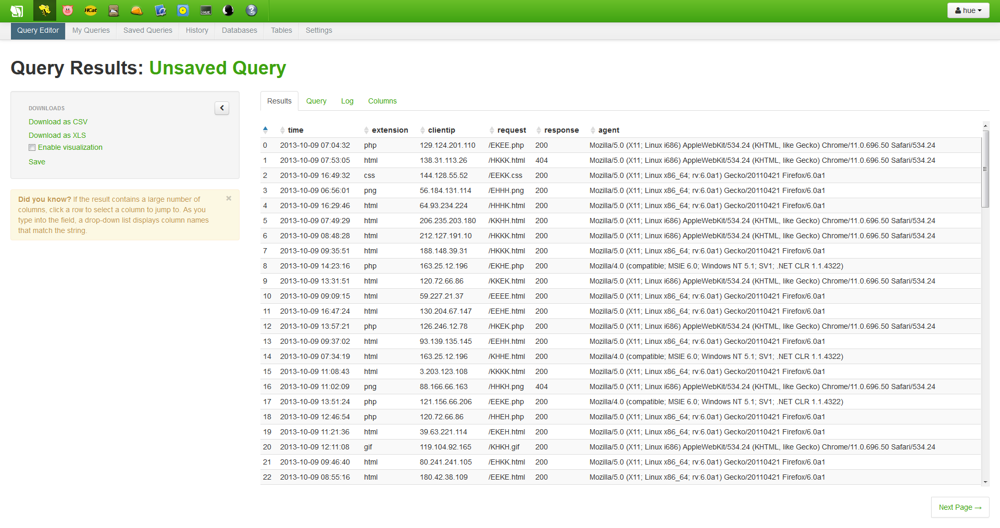
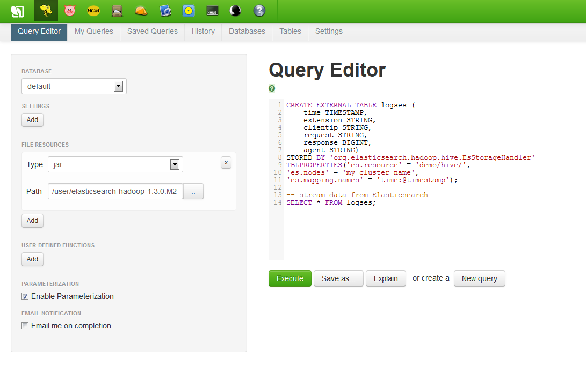

## Community Tutorial 07: elasticsearch-Hadoop Integration

This tutorial is from the Community part of tutorial for [Hortonworks Sandbox](http://hortonworks.com/products/sandbox) - a single-node Hadoop cluster running in a virtual machine. Download to run this and other tutorials in the series.

### Introduction

This tutorial is a basic step-by-step tutorial to get Hadoop and Elasticsearch talk to each other.

### Pre-requisites

To follow the steps in this tutorial, your computer must have the following items installed and running.

1. Hortonworks Sandbox VM
2. [elasticsearch](http://www.elasticsearch.org/overview/elasticsearch/) up & running
3. [elasticsearch-hadoop](http://www.elasticsearch.org/overview/hadoop/) jars 
4. [Kibana](http://www.elasticsearch.org/overview/kibana/) is a plus

### Files to be downloaded

Just download [apache.zip](http://download.elasticsearch.org/hadoop/short-video-1/apache.zip) from Costin Leau video tutorial.

### Setup
####Elasticsearch setup

Launch elasticsearch. We won't enter in details on how Elasticsearch works here as it is not our point. For more information, please refer to [elasticsearch website](http://www.elasticsearch.org/guide/).


####Hortonworks Sandbox
Download and launch the sandbox. It should show a screen like this one : 


Then connect to your sandbox (root user) and set your ```/etc/hosts``` so that it knows your elasticsearch cluster ip.

#### In your browser
You can now connect to the sandbox using your favorite browser at http://127.0.0.0.1:8000. You should see this screen : 

Click on "Go to sandbox", then follow these steps : 

1. In file browser, upload apache.zip (and note the path - for my exemple it will be ```/user/apache```)
2. Still in file browser, upload elasticsearch-hadoop jar (as for now elasticsearch-hadoop-1.3.0.M1.jar)
2. In Hive Query Editor, add elasticsearch-hadoop jar to your query
3. Then launch the following query (from [Costin Leau tutorial](https://gist.github.com/costin/8025827))
``` sql
CREATE TABLE logs (type STRING, time STRING, ext STRING, ip STRING, req STRING, res INT, bytes INT, phpmem INT, agent STRING)
ROW FORMAT DELIMITED FIELDS TERMINATED BY '\t';
LOAD DATA INPATH '/user/apache/apache.log' OVERWRITE INTO TABLE logs;
 
CREATE EXTERNAL TABLE eslogs (time STRING, extension STRING, clientip STRING, request STRING, response INT, agent STRING)
STORED BY 'org.elasticsearch.hadoop.hive.EsStorageHandler'
TBLPROPERTIES('es.resource' = 'demo/hive',
'es.mapping.names' = 'time:@timestamp',
'es.nodes' = 'your_es_cluster_hostname');
 
INSERT OVERWRITE TABLE eslogs SELECT s.time, s.ext, s.ip, s.req, s.res, s.agent FROM logs s;
```

You should now have you data injected in your elasticsearch cluster. (Note : I had to run queries seperatly).

To check if everything went well, you can now launch Kibana, set it up to crawl ```demo``` index, and you should be done.

#### Query data from elasticsearch
Next step is to query data from elasticsearch and use it in Hadoop. Back to your sandbox : 
1. In Hive Query Editor, add elasticsearch-hadoop jar to your query
2. Then launche the following query
``` sql
CREATE EXTERNAL TABLE logses (
    time  TIMESTAMP,
    extension    STRING,
    clientip STRING,
    request STRING,
    response BIGINT, 
    agent STRING)
STORED BY 'org.elasticsearch.hadoop.hive.EsStorageHandler'
TBLPROPERTIES('es.resource' = 'demo/hive/', 
'es.nodes' = 'your-es-cluster-hostname', 
'es.mapping.names' = 'time:@timestamp');

-- stream data from Elasticsearch
SELECT * FROM logses;
```

If everything went OK, , you should see something like this : 


#### Hive Query Editor Screenshot

