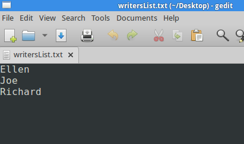
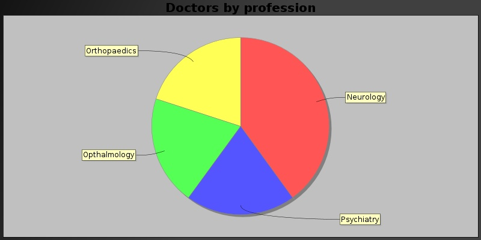

## Community Tutorial 08: Java-HBase Integration - Professional Analysis and Visualization Using HBase, Java and JFreeChart

This tutorial is from the Community part of tutorial for [Hortonworks Sandbox](http://hortonworks.com/products/sandbox) - a single-node Hadoop cluster running in a virtual machine. Download to run this and other tutorials in the series.

### Introduction

Ever wanted to run [HBase](http://hbase.apache.org "HBase") Queries from your own Java application? This tutorial helps you to do just that :) This tutorial takes up a sample scenario - Professional Analysis in Java using HBase. To complete the picture, visualization of the analysis is created using JFreeChart, a open source charting API.

### Pre-requisites

To follow the steps in this tutorial, your computer must have the following items installed and running.

1. Hortonworks Sandbox VM
2. Any Java Development & Runtime Environment (Open JDK is also good)
3. Preferably a Java IDE like Eclipse (If you use any other IDE like Intellij Idea or Netbeans, that is ok).  This tutorial explains the steps using Eclipse.
4. A working internet connection (to download the files mentioned in the tutorial
5. Minimum of 4098MB available as RAM for Sandbox VM (To Enable HBase)

### Files to be downloaded

1. **Apache HBase Archive:** We need HBase archive to add libraries (JARs) to our eclipse project.  From the "About Sandbox" link, note the version of HBase present in the Hortonworks Sandbox VM. Download the same version of HBase archive.  This example works on hadoop2 variation.  So, download the **hadoop2** variation and not the hadoop1 variation. Download Location: <http://www.apache.org/dyn/closer.cgi/hbase/>  \[**Note**: Extract the downloaded HBase archive file and ensure that it contains a "lib" directory\]

2. **JFreeChart Library:** JFreeChart is the open source charting library which we will use for creating graphical charts. Download Location: <http://sourceforge.net/projects/jfreechart/files/latest/download?source=files> \[**Note**: Extract the downloaded JFreeChart archive file and ensure that it contains a "lib" directory\]

### Steps Involved
####Eclipse Project Setup
1. Create an Eclipse Java Project with name "HBaseJavaIntegration".
2. Go to Project Properties window and in "Java Build Path" section, click on "Add External Jars"
3. In the JAR Selection dialog, select all jars in the "lib" directory of HBase and press OK.  This will add all HBase library jars to the eclipse project.
4. Similarly, add all the jars from the "lib" directory of JFreeChart as well.

####Hosts file setup
Add an entry of domain sandbox.hortonworks.com pointing to the IP Address 127.0.0.1 in your hosts file.

In Linux environments, the path of the hosts file is /etc/hosts.  In Windows, the path of the hosts file is %systemroot%\system32\drivers\etc\.

####HBase Table Creation
1. Launch Hortonworks Sandbox in browser.
2. Navigate to Hue Shell -> HBase Shell.
3. Execute the following command.

```
create 'professionals','medical-related','writer-related'
```
The above command creates a table with name 'professionals' with two column families namely, 'medical-related' and 'writer-related'.

####What does this example do?
In this example, we are trying to do the following things **using a Java Program**.

1. Add 4 doctors of variying specializations into table 'professionals'.  They will have entries in column family "medical-related".
2. Add 2 writers into the same table.  They will have entries in the column family "writer-related".
3. Add a professional "Joe" who is both a doctor and a writer.  So, he will have entries in both "medical-related" and "writer-related" column families.
4. Scan the table's "medical-related" column family and try to plot a pie chart based on specialization.  Store the pie chart as JPG file.
5. Scan the table's "writers" column family and try to print all the writers into a text file.  Verify that "Joe",the doctor-writer shows up in the list.

####Coding the Java Class
Create a Java class with name "HBaseProfessionAnalyser" and following code in it.

```
package com.vivekGanesan.hbaseJavaIntegration;
import java.awt.Color;
import java.awt.GradientPaint;
import java.awt.Point;
import java.io.File;
import java.io.IOException;
import java.io.InterruptedIOException;
import java.util.ArrayList;
import java.util.List;

import org.apache.commons.io.FileUtils;
import org.apache.hadoop.conf.Configuration;
import org.apache.hadoop.hbase.HBaseConfiguration;
import org.apache.hadoop.hbase.client.HBaseAdmin;
import org.apache.hadoop.hbase.client.HTable;
import org.apache.hadoop.hbase.client.Put;
import org.apache.hadoop.hbase.client.Result;
import org.apache.hadoop.hbase.client.ResultScanner;
import org.apache.hadoop.hbase.client.RetriesExhaustedWithDetailsException;
import org.apache.hadoop.hbase.util.Bytes;
import org.jfree.chart.ChartFactory;
import org.jfree.chart.ChartUtilities;
import org.jfree.chart.JFreeChart;
import org.jfree.data.general.DefaultPieDataset;

/**
 * This class assumes that there is already a table created using the following command from HBase console:
 * create 'professionals','medical-related','writer-related'
 * 
 * This example would not work without the above table named 'professionals'.
 * 
 * Also, make sure there is a hosts file entry with sandbox.hortonworks.com pointing to 127.0.0.1 
 *
 */

public class HBaseProfessionAnalyser {

    private static final String PIE_OUTPUT_PATH = "/home/vivek/Desktop/specialities.jpg";
	private static final String WRITER_LIST_OUTPUT_PATH = "/home/vivek/Desktop/writersList.txt";
	
	public static void main(String[] args) throws Exception {
		Configuration config = HBaseConfiguration.create();
		config.set("hbase.zookeeper.quorum", "localhost");
		config.set("hbase.zookeeper.property.clientport", "2181");
		config.set("zookeeper.znode.parent", "/hbase-unsecure"); //this is what most people miss :)
		HBaseAdmin.checkHBaseAvailable(config);

        //table name - professionals
		HTable table = new HTable(config, "professionals");
		try {
			putObjectsToTable(table);
			createPieChartFromMedicalSpeciality(table);
			createWritersListFile(table);
		} finally {
			table.close();
		}
	}
	
	private static List prepareDataSet() {
		List dataset = new ArrayList<Object>();
		// list of doctors
		dataset.add(new Doctor("John", 10, "Opthalmology"));
		dataset.add(new Doctor("David", 7, "Neurology"));
		dataset.add(new Doctor("Mary", 9, "Orthopaedics"));
		dataset.add(new Doctor("Susan", 9, "Neurology"));

		// list of writers
		dataset.add(new Writer("Richard", 3, 10));
		dataset.add(new Writer("Ellen", 5, 2));

		// Joe is both a doctor and a writer

		Doctor writerDoctor = new Doctor("Joe", 15, "Psychiatry");
		writerDoctor.setWriter(true);
		writerDoctor.setWriterDetails(new Writer("Joe", 2, 7));
		dataset.add(writerDoctor);
		return dataset;
	}
	
	private static void putObjectsToTable(HTable table) throws RetriesExhaustedWithDetailsException, InterruptedIOException{		
			List professionals = prepareDataSet();

			for (Object professional : professionals) {
				if (professional instanceof Doctor) {
					Put put = createDoctor((Doctor) professional);
					table.put(put);
				} else {
					Put put = createWriter((Writer) professional);
					table.put(put);
				}

			}
	}
	
	private static void createPieChartFromMedicalSpeciality(HTable table) throws IOException{
		DefaultPieDataset pieDataSet = new DefaultPieDataset();

		//scan a column family named "medical-related"
		ResultScanner scanner = table.getScanner("medical-related"
				.getBytes());

		Result rowResult = scanner.next();
		while (rowResult != null) {

			String specialization = new String(rowResult.getValue(
					Bytes.toBytes("medical-related"),
					Bytes.toBytes("specialization")));

			if (!pieDataSet.getKeys().contains(specialization)) {
				pieDataSet.setValue(specialization, 1);
			} else {
				pieDataSet.setValue(specialization,
						pieDataSet.getValue(specialization).intValue() + 1);
			}

			rowResult = scanner.next();
		}
		JFreeChart chart = ChartFactory.createPieChart(
				"Doctors by profession", // chart title
				pieDataSet, // data
				false, // no legend
				true, // tooltips
				false // no URL generation
				);

		// set a custom background for the chart
		chart.setBackgroundPaint(new GradientPaint(new Point(0, 0),
				new Color(20, 20, 20), new Point(400, 200), Color.DARK_GRAY));

		System.out.println("Saving chart as JPEG...");
		ChartUtilities.saveChartAsJPEG(new File(PIE_OUTPUT_PATH), chart, 800,
				400);
		System.out.println("Chart saved at " + PIE_OUTPUT_PATH);
	}
	
	public static void createWritersListFile(HTable table) throws IOException{
		ResultScanner scanner = table.getScanner("writer-related".getBytes());
		Result rowResult = scanner.next();
		String writers = "";
		while (rowResult != null) {

			writers += new String(rowResult.getRow()) + "\n";

			rowResult = scanner.next();
		}

		FileUtils.writeStringToFile(new File(
				WRITER_LIST_OUTPUT_PATH), writers);
	}
	

	private static Put createWriter(Writer writer) {
		Put put = new Put(writer.getName().getBytes());
		put.add("writer-related".getBytes(),
				"numberOfBooks".getBytes(),
				new byte[] { new Integer(writer.getNumberOfBooks()).byteValue() });

		put.add("writer-related".getBytes(), "awardsWon".getBytes(),
				new byte[] { new Integer(writer.getAwardsWon()).byteValue() });
		return put;
	}

	private static Put createDoctor(Doctor doctor) {
		Put put = new Put(doctor.getName().getBytes());
		put.add("medical-related".getBytes(), "numberOfPatients".getBytes(),
				new byte[] { new Integer(doctor.getNumberOfPatients())
						.byteValue() });
		put.add("medical-related".getBytes(), "specialization".getBytes(),
				doctor.getSpecialization().getBytes());
		if (doctor.isWriter()) {
			put.add("writer-related".getBytes(), "numberOfBooks".getBytes(),
					new byte[] { new Integer(doctor.getWriterDetails()
							.getNumberOfBooks()).byteValue() });

			put.add("writer-related".getBytes(), "awardsWon".getBytes(),
					new byte[] { new Integer(doctor.getWriterDetails()
							.getAwardsWon()).byteValue() });
		}

		return put;
	}

}

class Doctor {
	
	String name;
	
	int numberOfPatients;
	
	String specialization;
	
	private boolean isWriter;
	
	private Writer writerDetails;

	public Doctor(String name, int numberOfPatients, String specialization) {
		super();
		this.name = name;
		this.numberOfPatients = numberOfPatients;
		this.specialization = specialization;
	}

	public boolean isWriter() {
		return isWriter;
	}

	public void setWriter(boolean isWriter) {
		this.isWriter = isWriter;
	}

	public Writer getWriterDetails() {
		return writerDetails;
	}

	public String getName() {
		return name;
	}

	public void setName(String name) {
		this.name = name;
	}

	public int getNumberOfPatients() {
		return numberOfPatients;
	}

	public void setNumberOfPatients(int numberOfPatients) {
		this.numberOfPatients = numberOfPatients;
	}

	public String getSpecialization() {
		return specialization;
	}

	public void setSpecialization(String specialization) {
		this.specialization = specialization;
	}

	public void setWriterDetails(Writer writer) {
		this.writerDetails = writer;
	}
}

class Writer {
	
	String name;
	
	int numberOfBooks;
	
	int awardsWon;

	public Writer(String name, int numberOfBooks, int awardsWon) {
		super();
		this.name = name;
		this.numberOfBooks = numberOfBooks;
		this.awardsWon = awardsWon;
	}

	public String getName() {
		return name;
	}

	public void setName(String name) {
		this.name = name;
	}

	public int getNumberOfBooks() {
		return numberOfBooks;
	}

	public void setNumberOfBooks(int numberOfBooks) {
		this.numberOfBooks = numberOfBooks;
	}

	public int getAwardsWon() {
		return awardsWon;
	}

	public void setAwardsWon(int awardsWon) {
		this.awardsWon = awardsWon;
	}
}

```

Remember to change the output file path variables to suit your needs.

####Run and Generate Chart
1. Start the Hortonworks Sandbox VM.
2. After service has started, go to Eclipse, right click on "HBaseProfessionAnalyser" java class and select "Run -> As Java Application".
3. Check if the writers list text file has been generated.  Verify if "Joe" is also printed there. 
3. Check if chart has been generated in the output path specified in code.



####Next Steps
Tweak the code and play around :)

